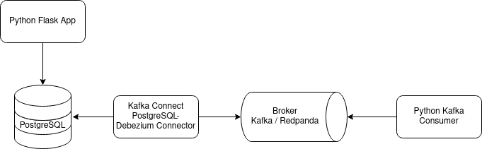
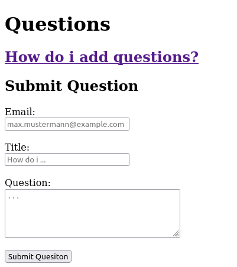
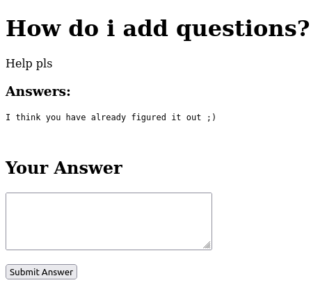
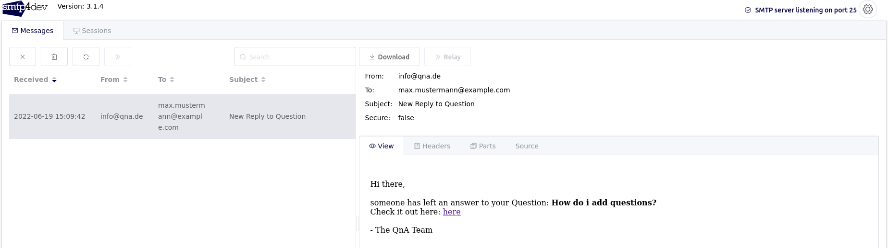

# Kafka-RedPanda-Streams-Demo
Demo application using either [Kafka](https://kafka.apache.org/) or [Redpanda](https://redpanda.com/) and Python.
Application mocks a QnA-Forum where you can ask questions or submit answers. 
Upon answer submission the asking user is notified via Email (mocked via SMTP4DEV) about the new answer. 
This is done via Change-Data-Capture with Kafka and Kafka Connect and Debezium.

## Architecture Overview

## Example Images
### Submitting a question

### Submit an answer

### Get Notified

## Usage
`start.sh redpanda|kafka`
